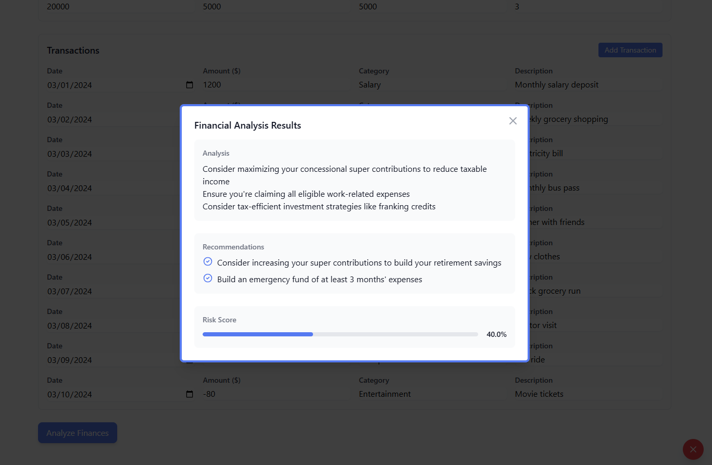

# 🚀 FinAI MVP - Intelligent Financial Advisory System

<div align="center">

[](https://github.com/boy-who-cried-wolf/fin-ai-mvp/blob/main/LICENSE)
[](https://www.typescriptlang.org/)
[](https://www.python.org/)
[](https://nodejs.org/)

</div>

## 📋 Overview

FinAI MVP is an intelligent financial advisory system that leverages artificial intelligence to provide personalized financial guidance. The system integrates Yodlee transaction data with AI-powered analysis to deliver actionable financial insights and recommendations.

## 📸 Preview

<div align="center">
  
  <p><em>FinAI MVP - Intelligent Financial Advisory Dashboard</em></p>
</div>

## ✨ Features

- **AI-Powered Financial Analysis**
  - Transaction categorization and analysis
  - Spending pattern recognition
  - Personalized financial recommendations
  - Natural language financial insights
  - Real-time financial data processing

- **Data Integration**
  - Yodlee API integration for transaction data
  - Secure data handling and processing
  - Real-time financial data analysis
  - Automated transaction categorization

- **User Experience**
  - Modern React-based interface
  - Responsive design with Tailwind CSS
  - Real-time financial dashboard
  - Interactive financial insights

## 📸 Preview

<div align="center">
  
  <p><em>FinAI MVP - Intelligent Financial Advisory Dashboard</em></p>
</div>

## 🛠️ Tech Stack

- **AI Component**
  - Python 3.9+
  - FastAPI
  - Machine Learning models

- **Frontend**
  - TypeScript
  - React
  - Tailwind CSS
  - Vite

- **Backend**
  - NestJS
  - TypeScript
  - RESTful API
  - PostgreSQL

- **Development Tools**
  - pnpm (Package Manager)
  - ESLint
  - Prettier
  - Git

## 🚀 Getting Started

### Prerequisites

- Node.js (v18 or higher)
- Python 3.9+
- pnpm (v8 or higher)
- Git

### Installation

1. Clone the repository:
   ```bash
   git clone https://github.com/boy-who-cried-wolf/fin-ai-mvp.git
   cd fin-ai-mvp
   ```

2. Install dependencies:
   ```bash
   # Install root dependencies
   pnpm install

   # Install AI component dependencies
   cd packages/ai
   pip install -r requirements.txt
   pip install -r requirements-dev.txt

   # Install frontend dependencies
   cd ../frontend
   pnpm install

   # Install backend dependencies
   cd ../backend
   pnpm install
   ```

3. Set up environment variables:
   ```bash
   # Copy and configure environment files
   cp packages/ai/.env.example packages/ai/.env
   cp packages/frontend/.env.example packages/frontend/.env
   cp packages/backend/.env.example packages/backend/.env
   ```

4. Start the development servers:
   ```bash
   # Start AI service
   cd packages/ai
   python main.py

   # Start backend service
   cd ../backend
   pnpm dev

   # Start frontend service
   cd ../frontend
   pnpm dev
   ```

## 📁 Project Structure

```
fin-ai-mvp/
├── packages/
│   ├── ai/              # AI/ML component
│   │   ├── src/        # Source code
│   │   ├── tests/      # Test files
│   │   └── main.py     # Entry point
│   ├── frontend/       # React frontend
│   │   ├── src/        # Source code
│   │   └── public/     # Static assets
│   └── backend/        # NestJS backend
│       └── src/        # Source code
├── package.json        # Root package configuration
└── pnpm-workspace.yaml # Workspace configuration
```

## 🤝 Contributing

Contributions are welcome! Please feel free to submit a Pull Request. For major changes, please open an issue first to discuss what you would like to change.

1. Fork the repository
2. Create your feature branch (`git checkout -b feature/AmazingFeature`)
3. Commit your changes (`git commit -m 'Add some AmazingFeature'`)
4. Push to the branch (`git push origin feature/AmazingFeature`)
5. Open a Pull Request

## 📝 License

This project is licensed under the MIT License - see the [LICENSE](LICENSE) file for details.

## 👨‍💻 Author

- **Rowell Camero** - [@boy-who-cried-wolf](https://github.com/boy-who-cried-wolf)
- **Email**: hdreamdev@gmail.com

## 🙏 Acknowledgments

- Yodlee API for financial data integration
- Open-source community for various tools and libraries
- Contributors and supporters of the project

---

<div align="center">
  
Made with ❤️ by [Rowell Camero](https://github.com/boy-who-cried-wolf)

</div> 